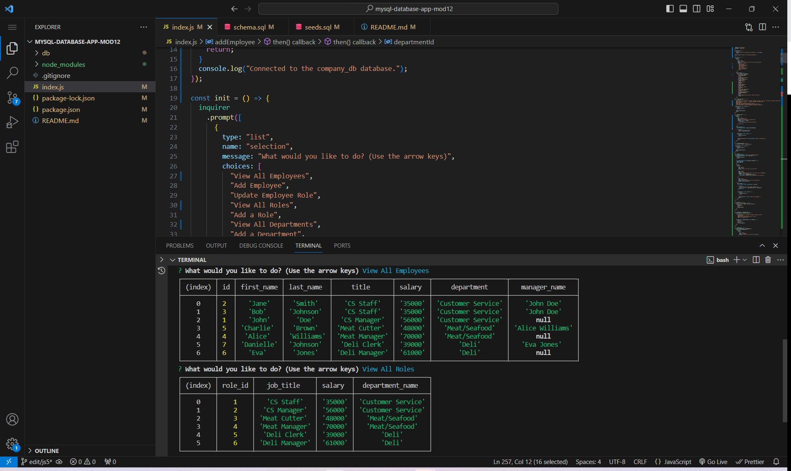

# Employee Database (MySQL) - Module 12 Challenge
## Description

This app was designed to provide users with a means to store data in a professional setting. Through use of this app,
The user can create and edit a list of employees, their roles, departments they belong to and who they report to. The entire
app is run through the terminal,.

I learned a lot about MySQL commands and table structure through working on this exercise. I also learned how to integrate
MySQL and Node prompts using inquirer, to make apps more streamlined and user friendly. 

## Installation

To use this app, the user must have both "inquirer" and "mysql2" packages installed. The user logs into MySQL and uploads the 
"schema.sql" and "seeds.sql" files using the command "SOURCE db/schema.sql and SOURCE db/seeds.sql." The app is run through the 
terminal with the command "node index.js" 

## Usage

To use this app, the user initializes it using "node index.js" From there, a prompt will appear asking the user what they wish
to do. The user may add/edit roles, view departments, view a list of employees and their respective roles, and update roles as
they see fit. When the user is done working with the database, they select the option "Quit" to exit the database."

## Credits

BCS Learning Assistant assisted in the development of this app.

## License

There is no license for this project.

## Link:

[Video of Operation](https://drive.google.com/file/d/1SBuHTjnNcbN3r9KMEQ68PqMIazVg_dwC/view)

## Screenshot of Note Taker Functionality

